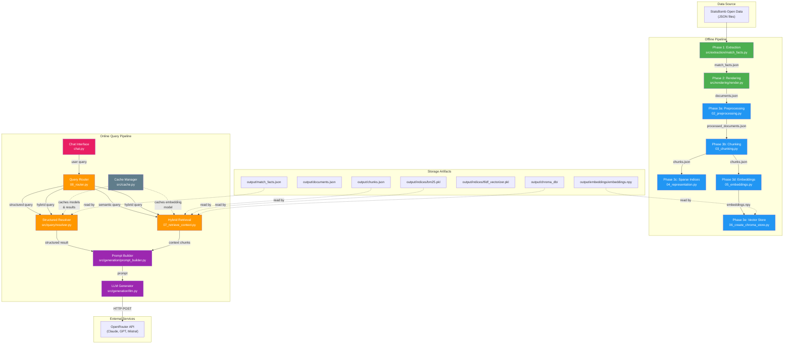
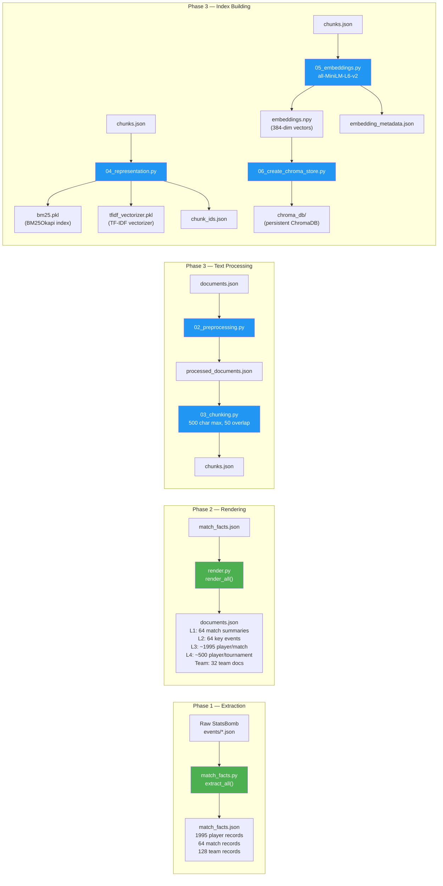
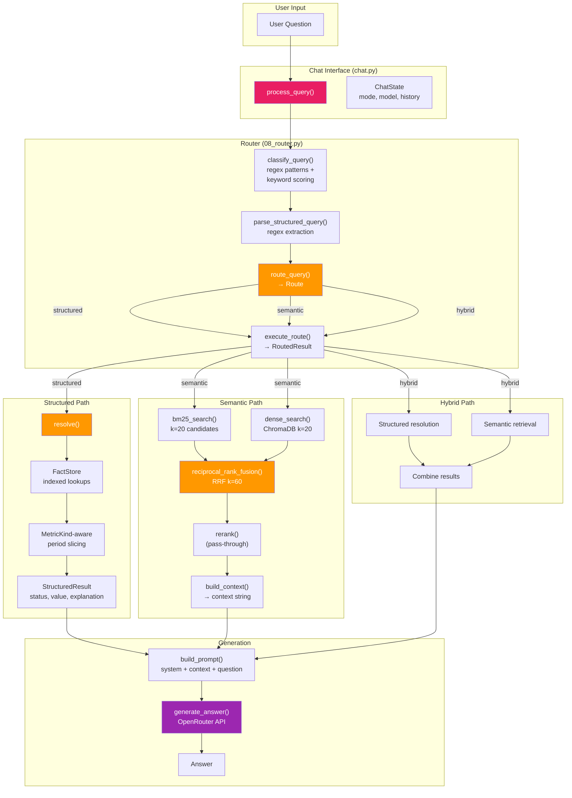
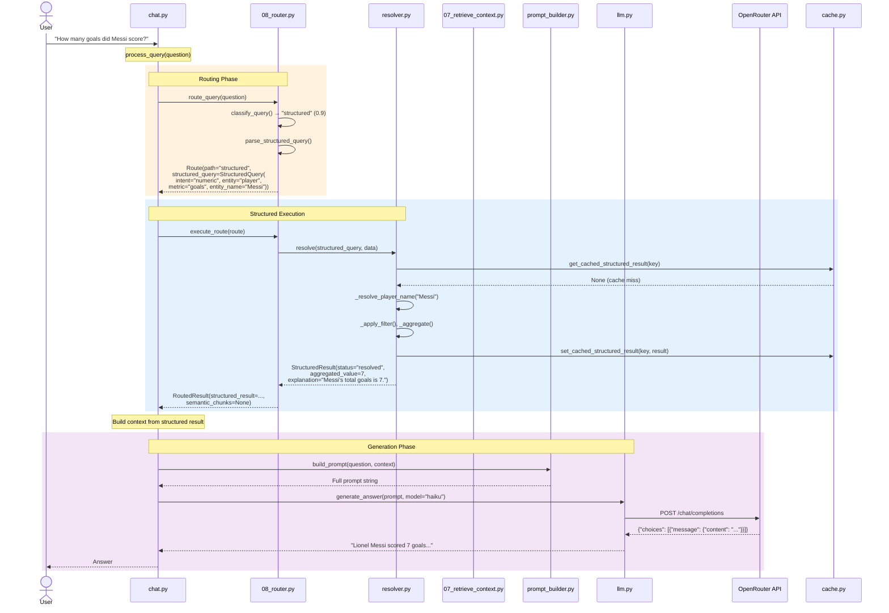

# FIFA World Cup 2022 RAG System — Architecture Documentation

> Generated from the implemented source code. Every diagram and description
> reflects the actual codebase — no invented components.

---

## 1. High-Level System Architecture

---

## 2. Offline Pipeline (Indexing)

**Pipeline orchestrator:** `rebuild.py` runs all steps sequentially. `--quick` flag skips embeddings/ChromaDB.

---

## 3. Online Query Pipeline

---

## 4. Sequence Diagram — Complete Query Flow

---

## 5. Component Responsibilities

### 5.1 Data Layer

| Module | File | Purpose | Output |
|--------|------|---------|--------|
| **Extraction** | `src/extraction/match_facts.py` | Parses raw StatsBomb JSON into typed records. Handles minutes-played algorithm, card detection, possession calculation, per-period breakdowns. | `match_facts.json` |
| **Extraction CLI** | `src/extraction/extract.py` | Entry point: calls `extract_all()` and `persist()` | `match_facts.json` |
| **Minutes Played** | `src/extraction/minutes_played.py` | Computes per-player minutes from lineups position segments. Handles phantom segments, red cards, inverted periods, duplicate segments. | In-memory |
| **Rendering** | `src/rendering/render.py` | Pure renderer: reads `match_facts.json`, produces natural-language documents. No statistics computation. | `documents.json` |
| **Render CLI** | `generate_documents.py` | Entry point: calls `render_all()` and `persist()` | `documents.json` |

### 5.2 Semantic Pipeline (Phase 3/4)

| Module | File | Purpose | Output |
|--------|------|---------|--------|
| **Preprocessing** | `02_preprocessing.py` | Unicode normalization, whitespace cleaning, punctuation normalization, control char removal. | `processed_documents.json` |
| **Chunking** | `03_chunking.py` | Sentence-based chunking (500 char max, 50 char overlap). | `chunks.json` |
| **Sparse Indices** | `04_representation.py` | Builds TF-IDF vectorizer and BM25Okapi index from chunks. | `bm25.pkl`, `tfidf_vectorizer.pkl`, `chunk_ids.json` |
| **Embeddings** | `05_embeddings.py` | Generates 384-dim sentence embeddings using `all-MiniLM-L6-v2`. | `embeddings.npy`, `embedding_metadata.json` |
| **Vector Store** | `06_create_chroma_store.py` | Creates persistent ChromaDB collection `wc2022_documents`. | `chroma_db/` directory |

### 5.3 Query Layer

| Module | File | Purpose |
|--------|------|---------|
| **Query Schema** | `src/query/query_schema.py` | Defines `Filter`, `StructuredQuery`, `StructuredResult` dataclasses. Intent types: numeric, superlative, slice, aggregation. |
| **Vocabulary** | `src/query/vocab.py` | Defines 27+ metrics with `MetricKind` (STORED, DERIVED_RATIO, MATCH_ONLY). Maps synonyms (goals→scored, xg→expected goals). Validates queries before execution. |
| **Resolver** | `src/query/resolver.py` | Executes `StructuredQuery` against `match_facts.json`. Indexed lookups via `FactStore`. Period-aware metric reading. Case-insensitive entity resolution with accent handling. |
| **Router** | `08_router.py` | Classifies queries as structured/semantic/hybrid using regex patterns + keyword scoring. Extracts stage filters. Parses structured queries from natural language. |

### 5.4 Retrieval Layer

| Module | File | Purpose |
|--------|------|---------|
| **Hybrid Retrieval** | `07_retrieve_context.py` | Combines BM25 lexical search (k=20) + ChromaDB dense search (k=20) via Reciprocal Rank Fusion (k=60). Includes comparison entity detection, team style query detection, match-level query detection. |

### 5.5 Generation Layer

| Module | File | Purpose |
|--------|------|---------|
| **Prompt Builder** | `src/generation/prompt_builder.py` | Builds prompts with system instructions (8 rules), retrieved context, and user question. Formats chunk metadata as source citations. Supports honest failure prompts. |
| **LLM Generator** | `src/generation/llm.py` | HTTP client for OpenRouter API. Supports 5 models: Claude Haiku, Claude Sonnet, GPT-4, GPT-3.5, Mistral. Returns generated text. |

### 5.6 Infrastructure

| Module | File | Purpose |
|--------|------|---------|
| **Cache** | `src/cache.py` | In-memory caching for embedding model (avoids reload) and structured query results (keyed by data hash, auto-invalidates). |
| **Chat** | `chat.py` | Interactive terminal interface. Commands: /context, /prompt, /route, /mode, /model, /history, /clear. Mode override (hybrid/semantic/structured). Conversation history for follow-ups. |
| **Rebuild** | `rebuild.py` | Orchestrates full pipeline rebuild. `--quick` skips embeddings/ChromaDB. |

---

## 6. Router Decision Logic

The router (`08_router.py`) classifies queries using a two-stage approach:

### Stage 1: Pattern Matching (high confidence)

| Pattern Type | Examples | Classification |
|-------------|----------|----------------|
| Numeric | "How many goals did Messi score?" | structured (0.9) |
| Superlative | "Who scored the most goals?" | structured (0.9) |
| Which-team | "Which team had the highest xG?" | structured (0.9) |
| Direct metric | "Messi goals" | structured (0.9) |
| Descriptive | "How did France play?" | semantic (0.9) |
| Tell-me | "Tell me about the final" | semantic (0.9) |
| Compare | "Compare Messi and Mbappé" | semantic (0.9) |

### Stage 2: Keyword Scoring (lower confidence)

If no pattern matches, count structured vs semantic keywords:
- `structured_pct > 0.7` → structured
- `semantic_pct > 0.7` → semantic
- Otherwise → hybrid (0.6)

### Execution Paths

| Path | Structured | Semantic | Hybrid |
|------|-----------|----------|--------|
| Resolver | ✅ | ❌ | ✅ |
| Retrieval | ❌ | ✅ | ✅ |
| Context source | `StructuredResult.explanation` | chunk text | Both combined |
| LLM prompt | Structured data first, labeled "authoritative" | Retrieved chunks | Structured + chunks |

---

## 7. Storage Artifacts

### Actually present in the code

| Artifact | Created By | Read By | Format |
|----------|-----------|---------|--------|
| `output/match_facts.json` | `src/extraction/extract.py` | `resolver.py`, `render.py`, `cache.py` | JSON (3 record types) |
| `output/documents.json` | `generate_documents.py` | `02_preprocessing.py` | JSON (5 doc levels) |
| `output/processed_documents.json` | `02_preprocessing.py` | `03_chunking.py` | JSON |
| `output/chunks.json` | `03_chunking.py` | `04_representation.py`, `05_embeddings.py`, `07_retrieve_context.py` | JSON |
| `output/indices/bm25.pkl` | `04_representation.py` | `07_retrieve_context.py` | Pickle (BM25Okapi) |
| `output/indices/tfidf_vectorizer.pkl` | `04_representation.py` | — (unused at query time) | Pickle |
| `output/indices/chunk_ids.json` | `04_representation.py` | — (unused at query time) | JSON |
| `output/embeddings/embeddings.npy` | `05_embeddings.py` | `06_create_chroma_store.py` | NumPy array |
| `output/embeddings/embedding_metadata.json` | `05_embeddings.py` | — (metadata only) | JSON |
| `output/chroma_db/` | `06_create_chroma_store.py` | `07_retrieve_context.py` | ChromaDB persistent |

### Legacy artifact (not in pipeline)

| Artifact | Created By | Status |
|----------|-----------|--------|
| `output/documents.json` | `01_documents.py` | **Deprecated** — superseded by `src/rendering/render.py` |

---

## 8. Architecture Review & Improvement Suggestions

### 8.1 Inconsistencies Found

| Issue | Location | Description |
|-------|----------|-------------|
| **`tfidf_vectorizer.pkl` is unused** | `04_representation.py` | Built during indexing but never loaded at query time. BM25 is used instead. Dead artifact. |
| **`chunk_ids.json` is unused** | `04_representation.py` | Built during indexing but never loaded at query time. Dead artifact. |
| **`embeddings.npy` intermediate** | `05_embeddings.py` → `06_create_chroma_store.py` | Embeddings are saved to `.npy` then re-loaded by ChromaDB creation. The `.npy` file is not needed at query time — ChromaDB stores its own embeddings. |
| **Legacy `01_documents.py`** | Root directory | 1560-line monolith that conflates Phase 1 and Phase 2. Marked deprecated but still present. |
| **`rerank()` is pass-through** | `07_retrieve_context.py:257` | Comment says "future: cross-encoder reranker" but implementation is `return results`. |
| **`resolve_from_text()` duplicated** | `resolver.py:663-720` | Duplicates regex parsing logic from `08_router.py`. Never called by the router. Dead code. |
| **Rebuild step numbering** | `rebuild.py:53-64` | Comments say "Phase 3" for preprocessing/chunking/representation and "Phase 4" for embeddings/ChromaDB, but ARCHITECTURE.md calls them Phase 4. Inconsistent numbering. |
| **`by_period` not in JSON** | `match_facts.json` | The extraction code populates `by_period` with string keys, but the shipped artifact has no `by_period` field. Extraction has not been re-run with updated code. |

### 8.2 Missing Connections

| Gap | Description |
|-----|-------------|
| **No structured→semantic fallback** | If the structured path returns "empty", the router does not retry with semantic search. The user gets "I don't have enough data" even if semantic chunks exist. |
| **Chat mode not wired to retrieval** | `state.mode` is now respected for routing, but `semantic_k` is hardcoded to 5. Mode-specific tuning (e.g., structured mode could skip retrieval entirely) is incomplete. |
| **No answer validation** | The LLM response is never validated against the structured data. If the LLM hallucinates a different number, there's no correction. |
| **History not used for context** | Conversation history is included in the prompt as text, but the retrieval step doesn't use prior turns to improve query formulation. |

### 8.3 Recommendations

| Priority | Recommendation |
|----------|---------------|
| 🔴 High | Re-run extraction (`python -m src.extraction.extract`) to regenerate `match_facts.json` with `by_period` data. This enables period-sliceable queries. |
| 🔴 High | Add structured→semantic fallback: if structured returns "empty" and the query is hybrid, execute semantic retrieval as backup. |
| 🟠 Medium | Implement cross-encoder reranker in `rerank()` using `cross-encoder/ms-marco-MiniLM-L-6-v2`. |
| 🟠 Medium | Remove dead artifacts: `tfidf_vectorizer.pkl`, `chunk_ids.json`, `embeddings.npy` from the pipeline output. |
| 🟠 Medium | Delete or fully deprecate `01_documents.py` and `resolve_from_text()`. |
| 🟡 Low | Add conversation-history-aware query reformulation: use prior turns to expand follow-up queries before retrieval. |
| 🟡 Low | Add answer validation: compare LLM output against structured data and flag discrepancies. |
| 🟡 Low | Standardize phase numbering across `rebuild.py` comments and `ARCHITECTURE.md`. |

---

## 9. Technology Stack

| Component | Technology | Version/Model |
|-----------|-----------|---------------|
| Embedding Model | sentence-transformers | `all-MiniLM-L6-v2` (384-dim) |
| Vector Store | ChromaDB | Persistent client |
| Sparse Retrieval | rank_bm25 | BM25Okapi |
| LLM API | OpenRouter | Claude Haiku/Sonnet, GPT-4, GPT-3.5, Mistral |
| HTTP Client | httpx | Sync POST requests |
| Data Format | JSON | match_facts.json, documents.json, chunks.json |
| Test Framework | pytest | Unit tests for extraction, routing, structured queries |
| Language | Python 3.14+ | Type hints, dataclasses, pathlib |

---

## 10. Document Levels

| Level | Grain | Count | Content |
|-------|-------|-------|---------|
| **L1** | One per match | 64 | Match summary: teams, score, stage, key events |
| **L2** | One per match | 64 | Key events: goals, cards, substitutions with build-up narration |
| **L3** | One per player per match | ~1995 | Player match performance: minutes, stats, context |
| **L4** | One per player | ~500 | Tournament aggregates: total goals, xG, minutes across all matches |
| **Team** | One per team | 32 | Team tournament aggregates: possession, formations, style |

---

## 11. MetricKind System

| Kind | Description | Period-Sliceable | Examples |
|------|-------------|-----------------|----------|
| **STORED** | Directly stored in records, sum across periods works | ✅ | goals, assists, xG, shots, passes, tackles, carries |
| **DERIVED_RATIO** | Computed from numerator/denominator | ✅ | pass_completion_pct, pass_pct |
| **MATCH_ONLY** | Match-grain value, no per-period breakdown | ❌ | minutes, possession_share, first_shot_minute, first_goal_minute |
