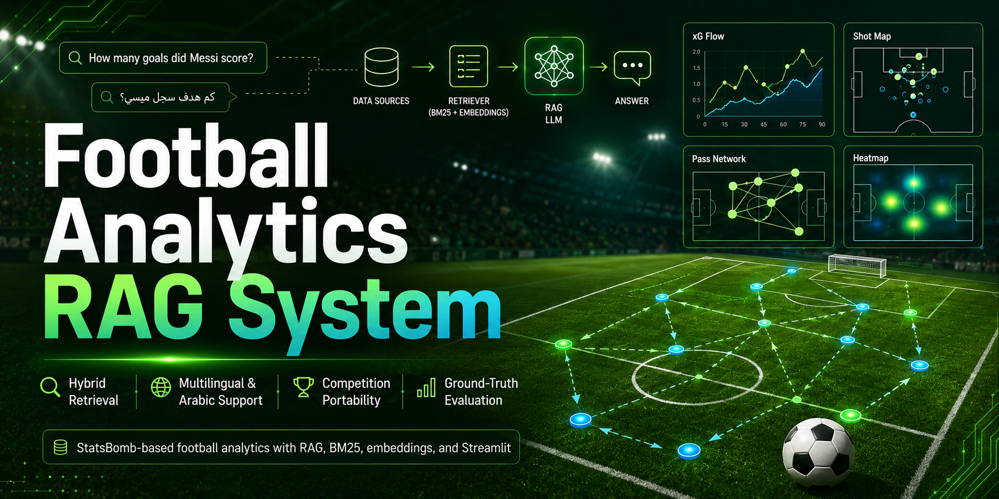

<p align="center">
  
</p>

# ⚽ Football Analytics RAG System

A production-oriented **Retrieval-Augmented Generation (RAG)** system for football analytics built on StatsBomb data. The project combines structured football facts, hybrid retrieval, multilingual and Arabic query support, competition portability, answerability checks, and ground-truth evaluation.

> **Current scope:** FIFA World Cup 2022 baseline with portability support for additional competitions, including EPL 2015/16.

## 🚀 Key Features

- **Competition Portability** — Dataset-aware architecture with competition and season-specific artifacts.
- **Hybrid Retrieval** — BM25 lexical retrieval + dense embeddings + Reciprocal Rank Fusion (RRF).
- **Structured Querying** — Deterministic handling of numeric, comparison, ranking, player, team, and match questions.
- **Query Routing** — Automatically selects the appropriate structured or semantic retrieval path.
- **Multilingual & Arabic Support** — Retrieval safeguards and Arabic-aware tokenization for cross-language football queries.
- **Evidence-Aware Context Selection** — Selects relevant chunks while reducing duplicate or weak evidence.
- **Answerability Checks** — Validates whether retrieved evidence is sufficient before generation.
- **Ground-Truth Evaluation** — Evaluates BM25, dense, and hybrid retrieval using reproducible test cases and ranking metrics.
- **StatsBomb Integration** — Structured extraction and document generation directly from football event data.
- **CLI + Streamlit Interface** — Supports both command-line analysis and an interactive web application.

## Quick Start

```bash
# 1. Clone the repository
git clone <repo-url>
cd football-analytics-rag

# 2. Install dependencies
pip install -r requirements.txt

# 3. Download StatsBomb open data
#    Download from: https://github.com/statsbomb/open-data
#    Extract to: open-data-master/data/

# 4. Rebuild all artifacts
python rebuild.py

# 5. Set your API key (for LLM generation)
export OPENROUTER_API_KEY="your-key-here"

# 6. Ask a question
python chat.py "How many goals did Messi score?"
```

## Project Structure

```
football-analytics-rag/
├── 01_documents.py              # Legacy pipeline entry
├── 02_preprocessing.py          # Text cleaning
├── 03_chunking.py               # Document chunking
├── 04_representation.py         # TF-IDF / BM25 indices
├── 05_embeddings.py             # Sentence embeddings
├── 06_create_chroma_store.py    # ChromaDB vector store
├── 07_retrieve_context.py       # Hybrid retrieval pipeline
├── 08_router.py                 # Query routing
├── chat.py                      # Interactive CLI
├── generate_documents.py        # Document generation CLI
├── extract.py                   # Structured extraction CLI
├── rebuild.py                   # Rebuild all artifacts
│
├── src/                         # Modular source code
│   ├── cache.py                 # Model & result caching
│   ├── extraction/              # Phase 1: Structured extraction
│   │   ├── minutes_played.py    #   Minutes algorithm
│   │   ├── match_facts.py       #   Schema + extraction logic
│   │   └── extract.py           #   CLI entry point
│   ├── rendering/               # Phase 2: Document rendering
│   │   └── render.py            #   Pure renderer
│   ├── query/                   # Phase 3: Structured queries
│   │   ├── vocab.py             #   Metric/dimension vocabularies
│   │   ├── query_schema.py      #   Query/Result schemas
│   │   └── resolver.py          #   Query executor
│   └── generation/              # Phase 6: LLM generation
│       ├── prompt_builder.py    #   Prompt construction
│       └── llm.py               #   OpenRouter integration
│
├── tests/                       # Unit tests
│   ├── test_extraction.py
│   ├── test_structured.py
│   └── test_router.py
│
├── output/                      # Generated artifacts (not committed)
│   ├── match_facts.json
│   ├── documents.json
│   ├── chunks.json
│   ├── indices/
│   ├── embeddings/
│   └── chroma_db/
│
├── requirements.txt
├── ARCHITECTURE.md
└── README.md
```

## Pipeline Architecture

```
Raw StatsBomb JSON
    │
    ▼
extract.py ──→ match_facts.json (structured layer)
    │
    ▼
generate_documents.py ──→ documents.json (rendered text)
    │
    ▼
02_preprocessing.py ──→ processed_documents.json
    │
    ▼
03_chunking.py ──→ chunks.json
    │
    ├──→ 04_representation.py ──→ BM25/TF-IDF indices
    │
    └──→ 05_embeddings.py ──→ Sentence embeddings
            │
            ▼
        06_create_chroma_store.py ──→ ChromaDB
            │
            ▼
        07_retrieve_context.py (hybrid retrieval)
            │
            ▼
        08_router.py (query routing)
            │
            ▼
        chat.py (interactive CLI)
```

## How to Run

### Interactive Chat

```bash
python chat.py
```

Commands:
- `/context` — Show retrieved context
- `/prompt` — Show full prompt
- `/route` — Show routing decision
- `/model` — Switch LLM model
- `/help` — Show help
- `/quit` — Exit

### Single Question

```bash
python chat.py "How many goals did Messi score?"
```

### Rebuild Artifacts

```bash
python rebuild.py          # Full rebuild
python rebuild.py --quick  # Skip embeddings/ChromaDB
```

## Environment Variables

| Variable | Required | Description |
|----------|----------|-------------|
| `OPENROUTER_API_KEY` | For LLM generation | OpenRouter API key |

## Example Queries

| Category | Query |
|----------|-------|
| **Numeric** | "How many goals did Messi score?" |
| **Superlative** | "Who scored the most goals?" |
| **Comparison** | "Compare Mbappé and Messi's performance" |
| **Match-level** | "How did France play in the final?" |
| **Player-specific** | "How did Griezmann perform against Poland?" |
| **Team-level** | "What was Argentina's playing style?" |
| **Stage-filtered** | "Mbappé assists in the semi-final" |

## Data Source

This system uses [StatsBomb Open Data](https://github.com/statsbomb/open-data) for the FIFA World Cup 2022 (competition_id=43, season_id=106).

**Note:** The raw data is not included in this repository. Download it separately and extract to `open-data-master/data/`.

## License

The source code in this repository is licensed under the **MIT License**. See [LICENSE](./LICENSE).

StatsBomb open data is **not covered by this repository's MIT License** and remains subject to StatsBomb's own open-data terms and attribution requirements.
